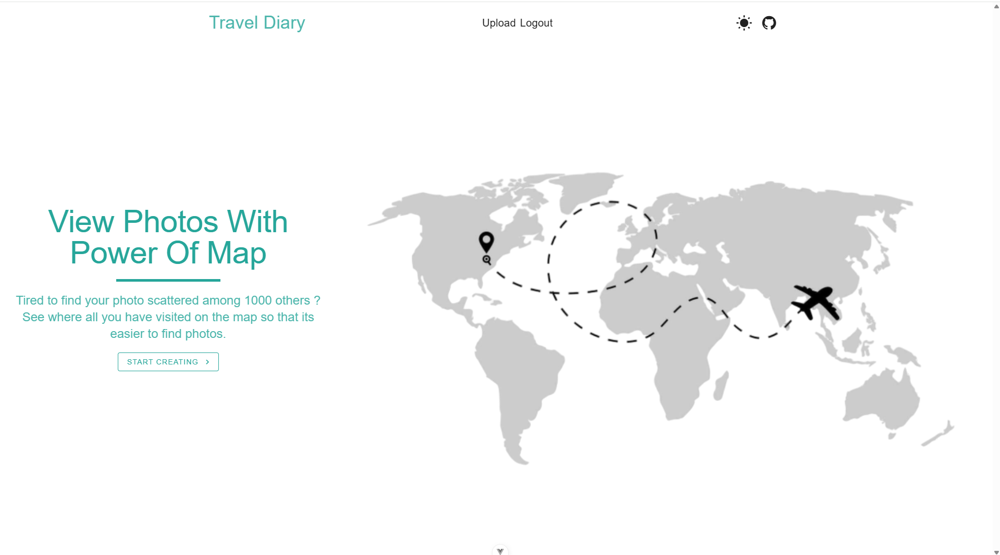
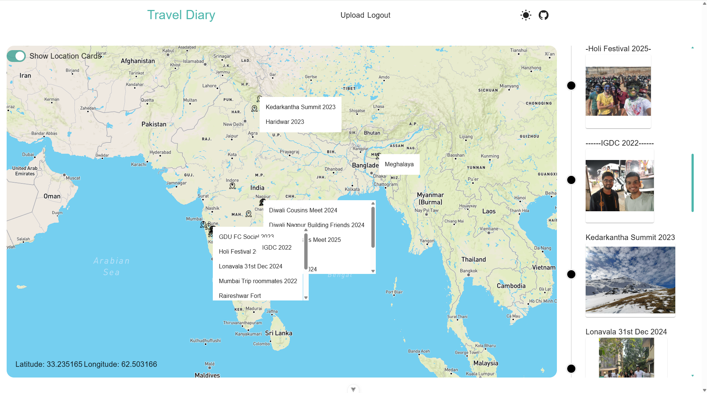
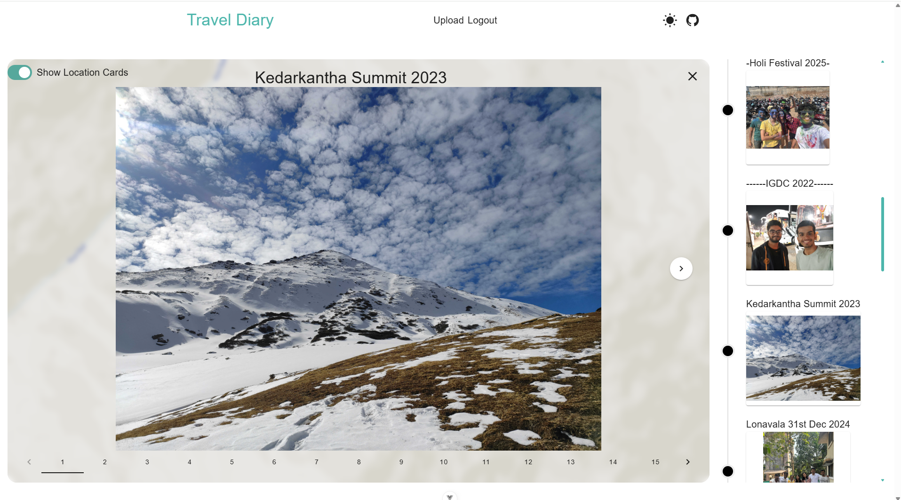

# Travel Diary

    

    <strong>
        <em>Travel Diary</em> is a tool that lets you visualize all your memories and places you have visited on the map. 
        Just upload the images and associate them to a particular location from the map and you are done.
    </strong>

    

## Usage

To start uploading images, you need to create an account.
You can do this by:

1. Logging in with Google (preferred)
2. Creating a unique username and password

Once logged in, head to the `/Upload` page to upload your images:

1. Select an existing collection from the "Trip Select" dropdown or create a new one
2. Choose a location on the map where the event took place
3. Upload your images
4. Visualize them on the map

Once uploaded, you can view your images in two ways:

- On the **timeline** on the right-hand side
- As **data cards** on the map

Click on either to view the images within that collection.

    

<em>You can view all your collections on the sidebar on the right.</em>

    

<em>Clicking a collection will let you browse all images within it.</em>

# For Local Development

## Frontend

1. Clone this repo
2. run `npm i`
3. Create a `.env` file at the root of the project and add these variables  
   3.1 `VITE_MAPBOX_TOKEN` The public key of Mapbox. This is necessary if you want to load the map  
   3.2 `VITE_APPLICATION_INSIGHTS_CONN_STRING` Application insights string to track some telemetry  
   3.3 `VITE_GOOGLE_CLIENT_ID` If you want to run your own login with google  

4. run `npm run dev` This will start the development server at `http://localhost:5173`

## Backend

In the `Queries.ts` there are two variables, `LOCAL_URL`, `PROD_URL`, replace these with your backend local and prod url.

Steps to run the backend locally

1. Clone the [Backend repo](https://github.com/HarshJainCodes/TravelMemoriesBackend)
2. In `appsettings.json` add these variables  
   2.1 `APPLICATIONINSIGHTS_CONNECTION_STRING` Application insights string to track some telemetry.  
   2.2 `ImageSqlServer` The SQL Server connection string. Metadata of images will be stored here.  
   2.3 `BlobStorage_ConnectionString` The Blob Storage connection string. All the images will be stored here.  
   2.4 `BlobStorage_ContainerName` The container name of the blob storage.  
   2.5 `IssuerSigningKeySecretText` To Sign your JWT Tokens.
3. In the Program.cs Add Cors Policy to whitelist your frontend URLs.
4. Apply EF Core migrations to your SQL database using `Update-Database`.
5. Run the project.
